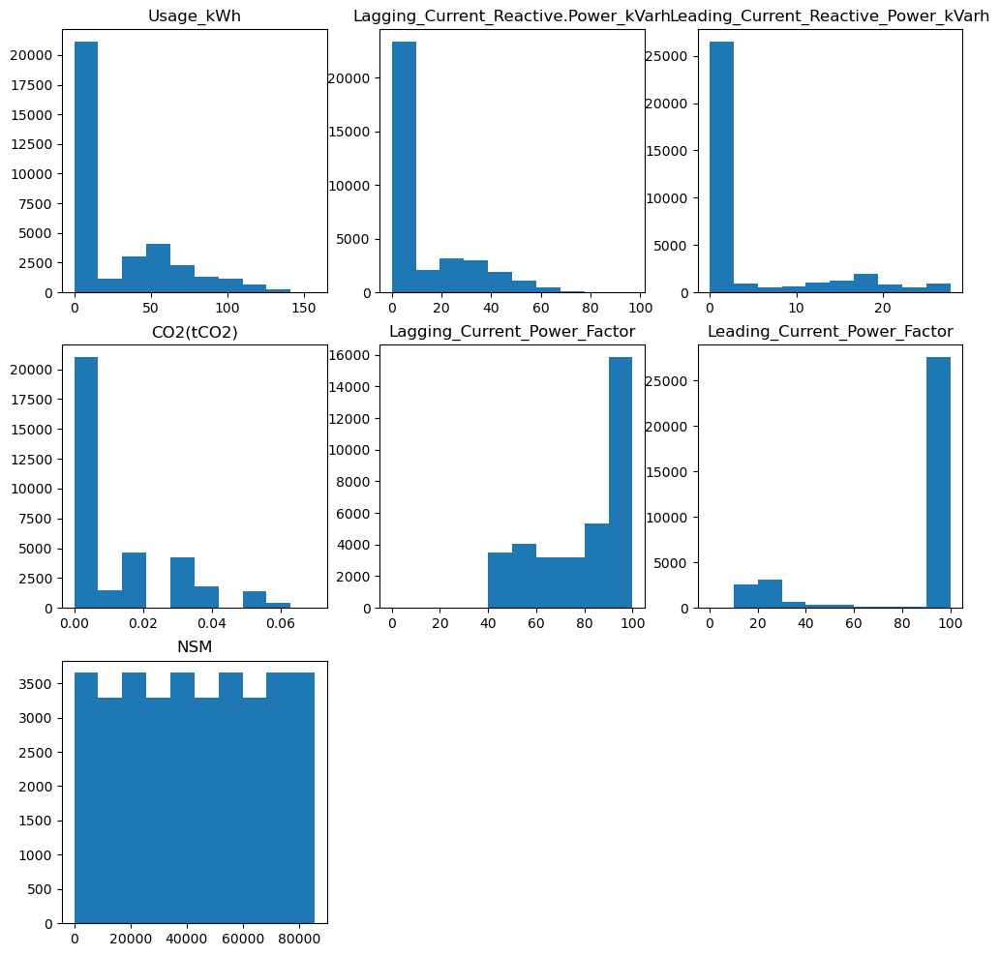

```python
import os
print(os.getcwd())
os.chdir('/Users/ryu/Desktop/데스크탑 - ryuseungho의 MacBook Air/2022/Bigdata/Machine-Learning/Clustering_Data')
print(os.getcwd())

import pandas as pd
import datetime
import math
import numpy as np
import matplotlib.pyplot as plt
%matplotlib inline
```

    /Users/ryu/Desktop/데스크탑 - ryuseungho의 MacBook Air/2022/Bigdata/Machine-Learning
    /Users/ryu/Desktop/데스크탑 - ryuseungho의 MacBook Air/2022/Bigdata/Machine-Learning/Clustering_Data


```python
# 파일 불러오기
Steel = pd.read_csv('./Steel_industry_data.csv')
Steel.head(3)
```


<div>
<style scoped>
    .dataframe tbody tr th:only-of-type {
        vertical-align: middle;
    }

    .dataframe tbody tr th {
        vertical-align: top;
    }

    .dataframe thead th {
        text-align: right;
    }
</style>
<table border="1" class="dataframe">
  <thead>
    <tr style="text-align: right;">
      <th></th>
      <th>date</th>
      <th>Usage_kWh</th>
      <th>Lagging_Current_Reactive.Power_kVarh</th>
      <th>Leading_Current_Reactive_Power_kVarh</th>
      <th>CO2(tCO2)</th>
      <th>Lagging_Current_Power_Factor</th>
      <th>Leading_Current_Power_Factor</th>
      <th>NSM</th>
      <th>WeekStatus</th>
      <th>Day_of_week</th>
      <th>Load_Type</th>
    </tr>
  </thead>
  <tbody>
    <tr>
      <th>0</th>
      <td>01/01/2018 00:15</td>
      <td>3.17</td>
      <td>2.95</td>
      <td>0.0</td>
      <td>0.0</td>
      <td>73.21</td>
      <td>100.0</td>
      <td>900</td>
      <td>Weekday</td>
      <td>Monday</td>
      <td>Light_Load</td>
    </tr>
    <tr>
      <th>1</th>
      <td>01/01/2018 00:30</td>
      <td>4.00</td>
      <td>4.46</td>
      <td>0.0</td>
      <td>0.0</td>
      <td>66.77</td>
      <td>100.0</td>
      <td>1800</td>
      <td>Weekday</td>
      <td>Monday</td>
      <td>Light_Load</td>
    </tr>
    <tr>
      <th>2</th>
      <td>01/01/2018 00:45</td>
      <td>3.24</td>
      <td>3.28</td>
      <td>0.0</td>
      <td>0.0</td>
      <td>70.28</td>
      <td>100.0</td>
      <td>2700</td>
      <td>Weekday</td>
      <td>Monday</td>
      <td>Light_Load</td>
    </tr>
  </tbody>
</table>
</div>


```python
Steel.info()
```

    <class 'pandas.core.frame.DataFrame'>
    RangeIndex: 35040 entries, 0 to 35039
    Data columns (total 11 columns):
     #   Column                                Non-Null Count  Dtype  
    ---  ------                                --------------  -----  
     0   date                                  35040 non-null  object 
     1   Usage_kWh                             35040 non-null  float64
     2   Lagging_Current_Reactive.Power_kVarh  35040 non-null  float64
     3   Leading_Current_Reactive_Power_kVarh  35040 non-null  float64
     4   CO2(tCO2)                             35040 non-null  float64
     5   Lagging_Current_Power_Factor          35040 non-null  float64
     6   Leading_Current_Power_Factor          35040 non-null  float64
     7   NSM                                   35040 non-null  int64  
     8   WeekStatus                            35040 non-null  object 
     9   Day_of_week                           35040 non-null  object 
     10  Load_Type                             35040 non-null  object 
    dtypes: float64(6), int64(1), object(4)
    memory usage: 2.9+ MB


---
### 속성 정보
 0   date  : 날짜  
 1   Usage_kWh : 산업 에너지 소비 연속(kWh)  
 2   Lagging_Current_Reactive.Power_kVarh : 지역 전류 무효 전력 연속(kVarh)  
 3   Leading_Current_Reactive_Power_kVarh : 선행 전류 무효 전력 연속(kVarh)  
 4   CO2(tCO2) : 연속(ppm)  
 5   Lagging_Current_Power_Factor : 지역 전류 역률 연속 (%)  
 6   Leading_Current_Power_Factor : 선행 전류 역률 연속 (%)  
 7   NSM : 자정부터의 시간(초) 연속  
 8   WeekStatus : 주 상태 범주 주말(0)   
 9   Day_of_week : 요일 (일, 월, 화, ~, 토)  
 10  Load_Type  


```python
Steel = Steel.iloc[:,1:8]
```


```python
Steel
```


<div>
<style scoped>
    .dataframe tbody tr th:only-of-type {
        vertical-align: middle;
    }

    .dataframe tbody tr th {
        vertical-align: top;
    }

    .dataframe thead th {
        text-align: right;
    }
</style>
<table border="1" class="dataframe">
  <thead>
    <tr style="text-align: right;">
      <th></th>
      <th>Usage_kWh</th>
      <th>Lagging_Current_Reactive.Power_kVarh</th>
      <th>Leading_Current_Reactive_Power_kVarh</th>
      <th>CO2(tCO2)</th>
      <th>Lagging_Current_Power_Factor</th>
      <th>Leading_Current_Power_Factor</th>
      <th>NSM</th>
    </tr>
  </thead>
  <tbody>
    <tr>
      <th>0</th>
      <td>3.17</td>
      <td>2.95</td>
      <td>0.00</td>
      <td>0.0</td>
      <td>73.21</td>
      <td>100.00</td>
      <td>900</td>
    </tr>
    <tr>
      <th>1</th>
      <td>4.00</td>
      <td>4.46</td>
      <td>0.00</td>
      <td>0.0</td>
      <td>66.77</td>
      <td>100.00</td>
      <td>1800</td>
    </tr>
    <tr>
      <th>2</th>
      <td>3.24</td>
      <td>3.28</td>
      <td>0.00</td>
      <td>0.0</td>
      <td>70.28</td>
      <td>100.00</td>
      <td>2700</td>
    </tr>
    <tr>
      <th>3</th>
      <td>3.31</td>
      <td>3.56</td>
      <td>0.00</td>
      <td>0.0</td>
      <td>68.09</td>
      <td>100.00</td>
      <td>3600</td>
    </tr>
    <tr>
      <th>4</th>
      <td>3.82</td>
      <td>4.50</td>
      <td>0.00</td>
      <td>0.0</td>
      <td>64.72</td>
      <td>100.00</td>
      <td>4500</td>
    </tr>
    <tr>
      <th>...</th>
      <td>...</td>
      <td>...</td>
      <td>...</td>
      <td>...</td>
      <td>...</td>
      <td>...</td>
      <td>...</td>
    </tr>
    <tr>
      <th>35035</th>
      <td>3.85</td>
      <td>4.86</td>
      <td>0.00</td>
      <td>0.0</td>
      <td>62.10</td>
      <td>100.00</td>
      <td>82800</td>
    </tr>
    <tr>
      <th>35036</th>
      <td>3.74</td>
      <td>3.74</td>
      <td>0.00</td>
      <td>0.0</td>
      <td>70.71</td>
      <td>100.00</td>
      <td>83700</td>
    </tr>
    <tr>
      <th>35037</th>
      <td>3.78</td>
      <td>3.17</td>
      <td>0.07</td>
      <td>0.0</td>
      <td>76.62</td>
      <td>99.98</td>
      <td>84600</td>
    </tr>
    <tr>
      <th>35038</th>
      <td>3.78</td>
      <td>3.06</td>
      <td>0.11</td>
      <td>0.0</td>
      <td>77.72</td>
      <td>99.96</td>
      <td>85500</td>
    </tr>
    <tr>
      <th>35039</th>
      <td>3.67</td>
      <td>3.02</td>
      <td>0.07</td>
      <td>0.0</td>
      <td>77.22</td>
      <td>99.98</td>
      <td>0</td>
    </tr>
  </tbody>
</table>
<p>35040 rows × 7 columns</p>
</div>


```python
Steel.columns
```


    Index(['Usage_kWh', 'Lagging_Current_Reactive.Power_kVarh',
           'Leading_Current_Reactive_Power_kVarh', 'CO2(tCO2)',
           'Lagging_Current_Power_Factor', 'Leading_Current_Power_Factor', 'NSM'],
          dtype='object')


```python
for i,j in enumerate(Steel.columns):
    print(i,j)
```

    0 Usage_kWh
    1 Lagging_Current_Reactive.Power_kVarh
    2 Leading_Current_Reactive_Power_kVarh
    3 CO2(tCO2)
    4 Lagging_Current_Power_Factor
    5 Leading_Current_Power_Factor
    6 NSM


```python
plt.figure(figsize = (12,12))
for i,j in enumerate(Steel.columns):
    plt.subplot(3,3,i+1)
    plt.hist(Steel[j])
    plt.title(j)
plt.show()
```


    

    


```python
# fig, (ax1, ax2, ax3) = plt.subplots(figsize = (12,4), nrows = 1, ncols=3)
# ax1.set_title('Usage_kWh')
# ax1.hist(Steel['Usage_kWh'])
# ax2.set_title('Lagging_Current_Reactive.Power_kVarh')
# ax2.hist(Steel['Lagging_Current_Reactive.Power_kVarh'])
# ax3.set_title('Leading_Current_Reactive_Power_kVarh')
# ax3.hist(Steel['Leading_Current_Reactive_Power_kVarh'])

```


```python
# fig, (ax1, ax2, ax3) = plt.subplots(figsize = (12,4), nrows = 1, ncols=3)
# ax1.set_title('CO2(tCO2)')
# ax1.hist(Steel['CO2(tCO2)'])
# ax2.set_title('Lagging_Current_Power_Factor')
# ax2.hist(Steel['Lagging_Current_Power_Factor'])
# ax3.set_title('Leading_Current_Power_Factor')
# ax3.hist(Steel['Leading_Current_Power_Factor'])
```


```python
from sklearn.preprocessing import StandardScaler
from sklearn.cluster import KMeans
from sklearn.metrics import silhouette_score, silhouette_samples

X_features = Steel[['Usage_kWh', 'Lagging_Current_Reactive.Power_kVarh', 'Leading_Current_Reactive_Power_kVarh','CO2(tCO2)','Lagging_Current_Power_Factor','Leading_Current_Power_Factor','NSM']].values
X_features_scaled = StandardScaler().fit_transform(X_features)

kmeans = KMeans(n_clusters = 7, random_state = 0)
labels = kmeans.fit_predict(X_features_scaled)
Steel['cluster_label'] = labels

print('실루엣 스코어는 : {0:.3f}'.format(silhouette_score(X_features_scaled, labels)))
```

    /opt/anaconda3/envs/tensorflow2/lib/python3.10/site-packages/scipy/__init__.py:146: UserWarning: A NumPy version >=1.16.5 and <1.23.0 is required for this version of SciPy (detected version 1.23.3
      warnings.warn(f"A NumPy version >={np_minversion} and <{np_maxversion}"


    실루엣 스코어는 : 0.457


```python
### 여러개의 클러스터링 갯수를 List로 입력 받아 각각의 실루엣 계수를 면적으로 시각화한 함수 작성 
def visualize_silhouette(cluster_lists, X_features):
    from sklearn.datasets import make_blobs
    from sklearn.cluster import KMeans
    from sklearn.metrics import silhouette_samples, silhouette_score

    import matplotlib.pyplot as plt 
    import matplotlib.cm as cm 
    import math

    # 입력값으로 클러스터링 갯수들을 리스트로 받아서, 각 갯수별로 클러스터링을 적용하고 실루엣 개수를 구함 
    n_cols = len(cluster_lists)

    # plt.subplots()으로 리스트에 기재된 클러스터링 만큼의 sub figures를 가지는 axs 생성 
    fig, axs = plt.subplots(figsize=(4*n_cols, 4), nrows=1, ncols=n_cols)

    # 리스트에 기재된 클러스터링 갯수들을 차례로 iteration 수행하면서 실루엣 개수 시각화 
    for ind, n_cluster in enumerate(cluster_lists):
        # KMeans 클러스터링 수행하고, 실루엣 스코어와 개별 데이터의 실루엣 값 계산. 
        clusterer = KMeans(n_clusters = n_cluster, max_iter=500, random_state=0) 
        cluster_labels = clusterer.fit_predict(X_features)

        sil_avg = silhouette_score(X_features, cluster_labels) 
        sil_values = silhouette_samples(X_features, cluster_labels)

        y_lower = 10
        axs[ind].set_title('Number of Cluster : '+ str(n_cluster)+'\n' \
                           'Silhouette Score :' + str(round(sil_avg,3)) )
        axs[ind].set_xlabel("The silhouette coefficient values") 
        axs[ind].set_ylabel("Cluster label")
        axs[ind].set_xlim([-0.1, 1])
        axs[ind].set_ylim([0, len(X_features) + (n_cluster + 1) * 10]) 
        axs[ind].set_yticks([])

        # Clear the yaxis labels / ticks 
        axs[ind].set_xticks([0, 0.2, 0.4, 0.6, 0.8, 1])
        # 클러스터링 갯수별로 fill_betweenx( )형태의 막대 그래프 표현. 
        for i in range(n_cluster):
            ith_cluster_sil_values = sil_values[cluster_labels==i] 
            ith_cluster_sil_values.sort()

            size_cluster_i = ith_cluster_sil_values.shape[0] 
            y_upper = y_lower + size_cluster_i

            color = cm.nipy_spectral(float(i) / n_cluster) 
            axs[ind].fill_betweenx(np.arange(y_lower, y_upper), 0, ith_cluster_sil_values, \
                                    facecolor=color, edgecolor=color, alpha=0.7) 

            axs[ind].text(-0.05, y_lower + 0.5 * size_cluster_i, str(i))
            y_lower = y_upper + 10
        axs[ind].axvline(x=sil_avg, color="red", linestyle="--")
```


```python
### 여러개의 클러스터링 갯수를 List로 입력 받아 각각의 클러스터링 결과를 시각화 
def visualize_kmeans_plot_multi(cluster_lists, X_features):
    from sklearn.cluster import KMeans 
    from sklearn.decomposition import PCA 
    import pandas as pd
    import numpy as np
    
    # plt.subplots()으로 리스트에 기재된 클러스터링 만큼의 sub figures를 가지는 axs 생성 
    n_cols = len(cluster_lists)
    fig, axs = plt.subplots(figsize=(4*n_cols, 4), nrows=1, ncols=n_cols)
    
    # 입력 데이터의 FEATURE가 여러개일 경우 2차원 데이터 시각화가 어려우므로 PCA 변환하여 2차원 시각화 
    pca = PCA(n_components=2)
    pca_transformed = pca.fit_transform(X_features)
    dataframe = pd.DataFrame(pca_transformed, columns=['PCA1','PCA2'])
    
    # 리스트에 기재된 클러스터링 갯수들을 차례로 iteration 수행하면서 KMeans 클러스터링 수행하고 시각화
    for ind, n_cluster in enumerate(cluster_lists):
        # KMeans 클러스터링으로 클러스터링 결과를 dataframe에 저장.
        clusterer = KMeans(n_clusters = n_cluster, max_iter=500, random_state=0) 
        cluster_labels = clusterer.fit_predict(pca_transformed) 
        dataframe['cluster']=cluster_labels
        
        unique_labels = np.unique(clusterer.labels_) 
        markers=['o', 's', '^', 'x', '*']
        
        # 클러스터링 결과값 별로 scatter plot 으로 시각화 
        for label in unique_labels:
            label_df = dataframe[dataframe['cluster']==label] 
            if label == -1:
                cluster_legend = 'Noise' 
            else :
                cluster_legend = 'Cluster '+str(label) 
            axs[ind].scatter(x=label_df['PCA1'], y=label_df['PCA2'], s=70,\
                                edgecolor='k', marker=markers[label], label=cluster_legend) 
            
            axs[ind].set_title('Number of Cluster : '+ str(n_cluster))
            axs[ind].legend(loc='upper right')
    plt.show() 
```


```python
visualize_silhouette([2,3,4,5],X_features_scaled)

visualize_kmeans_plot_multi([2,3,4,5],X_features_scaled)

```

    /var/folders/hf/9cldw65x7j71qr4hjbw44yjc0000gn/T/ipykernel_7512/1624528060.py:34: UserWarning: You passed a edgecolor/edgecolors ('k') for an unfilled marker ('x').  Matplotlib is ignoring the edgecolor in favor of the facecolor.  This behavior may change in the future.
      axs[ind].scatter(x=label_df['PCA1'], y=label_df['PCA2'], s=70,\
    /var/folders/hf/9cldw65x7j71qr4hjbw44yjc0000gn/T/ipykernel_7512/1624528060.py:34: UserWarning: You passed a edgecolor/edgecolors ('k') for an unfilled marker ('x').  Matplotlib is ignoring the edgecolor in favor of the facecolor.  This behavior may change in the future.
      axs[ind].scatter(x=label_df['PCA1'], y=label_df['PCA2'], s=70,\


    

    


    

    


```python
# ['Usage_kWh', 'Lagging_Current_Reactive.Power_kVarh', 'Leading_Current_Reactive_Power_kVarh',
#  'CO2(tCO2)','Lagging_Current_Power_Factor','Leading_Current_Power_Factor']
### Log 변환을 통해 데이터 변환
from sklearn.preprocessing import StandardScaler
from sklearn.cluster import KMeans
from sklearn.metrics import silhouette_score, silhouette_samples

# Recency, Frequency, Monetary 컬럼에 np.log1p() 로 Log Transformation
Steel['Usage_kWh_log'] = np.log1p(Steel['Usage_kWh'])
Steel['Lagging_Current_Reactive.Power_kVarh_log'] = np.log1p(Steel['Lagging_Current_Reactive.Power_kVarh'])
Steel['Leading_Current_Reactive_Power_kVarh_log'] = np.log1p(Steel['Leading_Current_Reactive_Power_kVarh'])
Steel['CO2(tCO2)_log'] = np.log1p(Steel['CO2(tCO2)'])
Steel['Lagging_Current_Power_Factor_log'] = np.log1p(Steel['Lagging_Current_Power_Factor'])
Steel['Leading_Current_Power_Factor_log'] = np.log1p(Steel['Leading_Current_Power_Factor'])
Steel['NSM_log'] = np.log1p(Steel['NSM'])

# Log Transformation 데이터 StandardScaler 적용
X_features = Steel[['Usage_kWh_log', 'Lagging_Current_Reactive.Power_kVarh_log', 'Leading_Current_Reactive_Power_kVarh_log','CO2(tCO2)_log','Lagging_Current_Power_Factor_log','Leading_Current_Power_Factor_log']].values
X_features_scaled = StandardScaler().fit_transform(X_features)

kmeans = KMeans(n_clusters = 7, random_state = 0)
labels = kmeans.fit_predict(X_features_scaled)
Steel['cluster_labels'] = labels

print('실루엣 스코어는 : {0:.3f}'.format(silhouette_score(X_features_scaled, labels)))
```

    실루엣 스코어는 : 0.539


```python
visualize_silhouette([2,3,4,5],X_features_scaled)

visualize_kmeans_plot_multi([2,3,4,5],X_features_scaled)
```

    /var/folders/hf/9cldw65x7j71qr4hjbw44yjc0000gn/T/ipykernel_7512/1624528060.py:34: UserWarning: You passed a edgecolor/edgecolors ('k') for an unfilled marker ('x').  Matplotlib is ignoring the edgecolor in favor of the facecolor.  This behavior may change in the future.
      axs[ind].scatter(x=label_df['PCA1'], y=label_df['PCA2'], s=70,\
    /var/folders/hf/9cldw65x7j71qr4hjbw44yjc0000gn/T/ipykernel_7512/1624528060.py:34: UserWarning: You passed a edgecolor/edgecolors ('k') for an unfilled marker ('x').  Matplotlib is ignoring the edgecolor in favor of the facecolor.  This behavior may change in the future.
      axs[ind].scatter(x=label_df['PCA1'], y=label_df['PCA2'], s=70,\


    

    


    

    


---
---
## 변수 6개


```python
# 파일 불러오기
Steel = pd.read_csv('./Steel_industry_data.csv')
Steel.head(3)
```


<div>
<style scoped>
    .dataframe tbody tr th:only-of-type {
        vertical-align: middle;
    }

    .dataframe tbody tr th {
        vertical-align: top;
    }

    .dataframe thead th {
        text-align: right;
    }
</style>
<table border="1" class="dataframe">
  <thead>
    <tr style="text-align: right;">
      <th></th>
      <th>date</th>
      <th>Usage_kWh</th>
      <th>Lagging_Current_Reactive.Power_kVarh</th>
      <th>Leading_Current_Reactive_Power_kVarh</th>
      <th>CO2(tCO2)</th>
      <th>Lagging_Current_Power_Factor</th>
      <th>Leading_Current_Power_Factor</th>
      <th>NSM</th>
      <th>WeekStatus</th>
      <th>Day_of_week</th>
      <th>Load_Type</th>
    </tr>
  </thead>
  <tbody>
    <tr>
      <th>0</th>
      <td>01/01/2018 00:15</td>
      <td>3.17</td>
      <td>2.95</td>
      <td>0.0</td>
      <td>0.0</td>
      <td>73.21</td>
      <td>100.0</td>
      <td>900</td>
      <td>Weekday</td>
      <td>Monday</td>
      <td>Light_Load</td>
    </tr>
    <tr>
      <th>1</th>
      <td>01/01/2018 00:30</td>
      <td>4.00</td>
      <td>4.46</td>
      <td>0.0</td>
      <td>0.0</td>
      <td>66.77</td>
      <td>100.0</td>
      <td>1800</td>
      <td>Weekday</td>
      <td>Monday</td>
      <td>Light_Load</td>
    </tr>
    <tr>
      <th>2</th>
      <td>01/01/2018 00:45</td>
      <td>3.24</td>
      <td>3.28</td>
      <td>0.0</td>
      <td>0.0</td>
      <td>70.28</td>
      <td>100.0</td>
      <td>2700</td>
      <td>Weekday</td>
      <td>Monday</td>
      <td>Light_Load</td>
    </tr>
  </tbody>
</table>
</div>


```python
Steel = Steel.iloc[:,1:7]
```


```python
plt.figure(figsize = (12,8))
for i,j in enumerate(Steel.columns):
    plt.subplot(3,3,i+1)
    plt.hist(Steel[j])
    plt.title(j)
plt.show()
```


    

    


```python
from sklearn.preprocessing import StandardScaler
from sklearn.cluster import KMeans
from sklearn.metrics import silhouette_score, silhouette_samples

X_features = Steel[['Usage_kWh', 'Lagging_Current_Reactive.Power_kVarh', 'Leading_Current_Reactive_Power_kVarh','CO2(tCO2)','Lagging_Current_Power_Factor','Leading_Current_Power_Factor']].values
X_features_scaled = StandardScaler().fit_transform(X_features)

kmeans = KMeans(n_clusters = 6, random_state = 0)
labels = kmeans.fit_predict(X_features_scaled)
Steel['cluster_label'] = labels

print('실루엣 스코어는 : {0:.3f}'.format(silhouette_score(X_features_scaled, labels)))
```

    실루엣 스코어는 : 0.538


```python
visualize_silhouette([2,3,4,5],X_features_scaled)

visualize_kmeans_plot_multi([2,3,4,5],X_features_scaled)

```

    /var/folders/hf/9cldw65x7j71qr4hjbw44yjc0000gn/T/ipykernel_7512/1624528060.py:34: UserWarning: You passed a edgecolor/edgecolors ('k') for an unfilled marker ('x').  Matplotlib is ignoring the edgecolor in favor of the facecolor.  This behavior may change in the future.
      axs[ind].scatter(x=label_df['PCA1'], y=label_df['PCA2'], s=70,\
    /var/folders/hf/9cldw65x7j71qr4hjbw44yjc0000gn/T/ipykernel_7512/1624528060.py:34: UserWarning: You passed a edgecolor/edgecolors ('k') for an unfilled marker ('x').  Matplotlib is ignoring the edgecolor in favor of the facecolor.  This behavior may change in the future.
      axs[ind].scatter(x=label_df['PCA1'], y=label_df['PCA2'], s=70,\


    

    


    

    


```python
# ['Usage_kWh', 'Lagging_Current_Reactive.Power_kVarh', 'Leading_Current_Reactive_Power_kVarh',
#  'CO2(tCO2)','Lagging_Current_Power_Factor','Leading_Current_Power_Factor']
### Log 변환을 통해 데이터 변환
from sklearn.preprocessing import StandardScaler
from sklearn.cluster import KMeans
from sklearn.metrics import silhouette_score, silhouette_samples

# Recency, Frequency, Monetary 컬럼에 np.log1p() 로 Log Transformation
Steel['Usage_kWh_log'] = np.log1p(Steel['Usage_kWh'])
Steel['Lagging_Current_Reactive.Power_kVarh_log'] = np.log1p(Steel['Lagging_Current_Reactive.Power_kVarh'])
Steel['Leading_Current_Reactive_Power_kVarh_log'] = np.log1p(Steel['Leading_Current_Reactive_Power_kVarh'])
Steel['CO2(tCO2)_log'] = np.log1p(Steel['CO2(tCO2)'])
Steel['Lagging_Current_Power_Factor_log'] = np.log1p(Steel['Lagging_Current_Power_Factor'])
Steel['Leading_Current_Power_Factor_log'] = np.log1p(Steel['Leading_Current_Power_Factor'])

# Log Transformation 데이터 StandardScaler 적용
X_features = Steel[['Usage_kWh_log', 'Lagging_Current_Reactive.Power_kVarh_log', 'Leading_Current_Reactive_Power_kVarh_log','CO2(tCO2)_log','Lagging_Current_Power_Factor_log','Leading_Current_Power_Factor_log']].values
X_features_scaled = StandardScaler().fit_transform(X_features)

kmeans = KMeans(n_clusters = 6, random_state = 0)
labels = kmeans.fit_predict(X_features_scaled)
Steel['cluster_labels'] = labels

print('실루엣 스코어는 : {0:.3f}'.format(silhouette_score(X_features_scaled, labels)))
```

    실루엣 스코어는 : 0.566


```python
visualize_silhouette([2,3,4,5],X_features_scaled)

visualize_kmeans_plot_multi([2,3,4,5],X_features_scaled)

```

    /var/folders/hf/9cldw65x7j71qr4hjbw44yjc0000gn/T/ipykernel_7512/1624528060.py:34: UserWarning: You passed a edgecolor/edgecolors ('k') for an unfilled marker ('x').  Matplotlib is ignoring the edgecolor in favor of the facecolor.  This behavior may change in the future.
      axs[ind].scatter(x=label_df['PCA1'], y=label_df['PCA2'], s=70,\
    /var/folders/hf/9cldw65x7j71qr4hjbw44yjc0000gn/T/ipykernel_7512/1624528060.py:34: UserWarning: You passed a edgecolor/edgecolors ('k') for an unfilled marker ('x').  Matplotlib is ignoring the edgecolor in favor of the facecolor.  This behavior may change in the future.
      axs[ind].scatter(x=label_df['PCA1'], y=label_df['PCA2'], s=70,\


    

    


    

    

