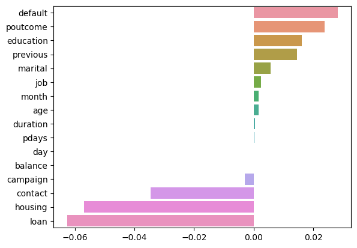
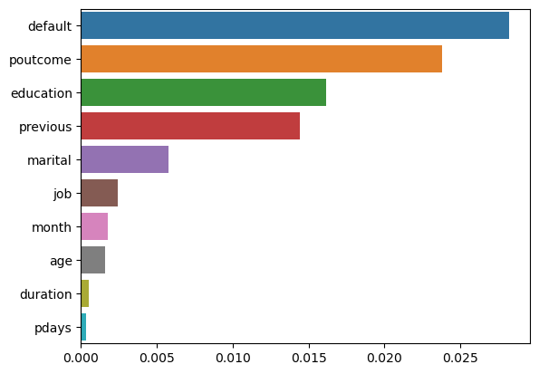

#  Bank Marketing
https://archive.ics.uci.edu/ml/datasets/Bank+Marketing

은행 고객 데이터:  
1 - age : 나이 (숫자)

2 - job : 직업 유형(카테고리: '관리', '블루칼라', '기업가', '하녀', '관리', '은퇴', '자영업', '서비스', '학생' , '기술자', '실직자', '알 수 없음')

3 - marital : 혼인 여부(범주: '이혼', '기혼', '미혼', '모름'; 참고: '이혼'은 이혼 또는 사별을 의미함)

4 - education 교육 (카테고리: 'basic.4y','basic.6y','basic.9y','high.school','문맹','professional.course','university.degree','알 수 없음')

5 - default : 기본 신용이 있습니까? (범주: '아니오', '예', '알 수 없음')

6 - 주택: 주택 융자가 있습니까? (범주: '아니오', '예', '알 수 없음')

7 - 대출: 개인 대출이 있습니까? (범주: '아니오', '예', '알 수 없음')

현재 캠페인의 마지막 연락처와 관련:  
8 - 연락처: 연락처 통신 유형(카테고리: '셀룰러', '전화')

9 - 월: 연도의 마지막 접촉 월(범주: 'jan', 'feb', 'mar', ..., 'nov', 'dec')

10 - day_of_week: 해당 주의 마지막 연락일(카테고리: '월', '화', '수', '목', '금')

11 - 지속 시간: 마지막 접촉 지속 시간(초)(숫자). 중요 참고 사항: 이 속성은 출력 대상에 큰 영향을 미칩니다(예: duration=0이면 y='no'). 그러나 호출이 수행되기 전의 지속 시간은 알 수 없습니다. 또한 호출이 끝난 후 y는 분명히 알려져 있습니다. 따라서 이 입력은 벤치마크 목적으로만 포함되어야 하며 실제 예측 모델을 갖고자 하는 경우에는 폐기해야 합니다.

다른 속성:
12 - 캠페인: 이 캠페인 동안 및 이 클라이언트에 대해 수행된 컨택 수(숫자, 마지막 컨택 포함)

13 - pdays: 이전 캠페인에서 클라이언트가 마지막으로 연락된 후 경과한 일 수(숫자, 999는 클라이언트가 이전에 연락되지 않았음을 의미함)

14 - 이전: 이 캠페인 이전에 이 클라이언트에 대해 수행된 컨택 수(숫자)

15 - poutcome: 이전 마케팅 캠페인의 결과(카테고리: '실패', '존재하지 않음', '성공')

사회적, 경제적 맥락 속성  
16 - emp.var.rate: 고용 변동률 - 분기별 지표(숫자)

17 - cons.price.idx: 소비자 물가 지수 - 월별 지표(숫자)

18 - cons.conf.idx: 소비자 신뢰 지수 - 월별 지표(숫자)

19 - euribor3m: euribor 3개월 요금 - 일일 표시기(숫자)

20 - nr.Employee: 직원 수 - 분기별 지표(숫자)

출력 변수(원하는 대상):  
21 - y - 고객이 정기 예금에 가입했습니까? (이진법: '예', '아니오')

## 데이터 경로 설정


```python
import os
print("변경 전 경로 : ",os.getcwd())
os.chdir('/Users/ryu/Desktop/데스크탑 - ryuseungho의 MacBook Air/2022/Bigdata/Machine-Learning/Bank_Marketing_Data')
print("변경 후 경로 : ",os.getcwd())
```

    변경 전 경로 :  /Users/ryu/Desktop/데스크탑 - ryuseungho의 MacBook Air/2022/Bigdata/Machine-Learning
    변경 후 경로 :  /Users/ryu/Desktop/데스크탑 - ryuseungho의 MacBook Air/2022/Bigdata/Machine-Learning/Bank_Marketing_Data


```python
import numpy as np
import pandas as pd
import seaborn as sns
import matplotlib.pyplot as plt
%matplotlib inline

# 경고 메시지 무시
import warnings
warnings.filterwarnings('ignore', category = RuntimeWarning)
```

    /opt/anaconda3/envs/tensorflow2/lib/python3.10/site-packages/scipy/__init__.py:146: UserWarning: A NumPy version >=1.16.5 and <1.23.0 is required for this version of SciPy (detected version 1.23.3
      warnings.warn(f"A NumPy version >={np_minversion} and <{np_maxversion}"


```python
# 데이터 불러오기
Bank_df = pd.read_csv('./bank.csv')

print(Bank_df.shape)
Bank_df.head()
```

    (4521, 17)


<div>
<style scoped>
    .dataframe tbody tr th:only-of-type {
        vertical-align: middle;
    }

    .dataframe tbody tr th {
        vertical-align: top;
    }

    .dataframe thead th {
        text-align: right;
    }
</style>
<table border="1" class="dataframe">
  <thead>
    <tr style="text-align: right;">
      <th></th>
      <th>age</th>
      <th>job</th>
      <th>marital</th>
      <th>education</th>
      <th>default</th>
      <th>balance</th>
      <th>housing</th>
      <th>loan</th>
      <th>contact</th>
      <th>day</th>
      <th>month</th>
      <th>duration</th>
      <th>campaign</th>
      <th>pdays</th>
      <th>previous</th>
      <th>poutcome</th>
      <th>y</th>
    </tr>
  </thead>
  <tbody>
    <tr>
      <th>0</th>
      <td>30</td>
      <td>unemployed</td>
      <td>married</td>
      <td>primary</td>
      <td>no</td>
      <td>1787</td>
      <td>no</td>
      <td>no</td>
      <td>cellular</td>
      <td>19</td>
      <td>oct</td>
      <td>79</td>
      <td>1</td>
      <td>-1</td>
      <td>0</td>
      <td>unknown</td>
      <td>no</td>
    </tr>
    <tr>
      <th>1</th>
      <td>33</td>
      <td>services</td>
      <td>married</td>
      <td>secondary</td>
      <td>no</td>
      <td>4789</td>
      <td>yes</td>
      <td>yes</td>
      <td>cellular</td>
      <td>11</td>
      <td>may</td>
      <td>220</td>
      <td>1</td>
      <td>339</td>
      <td>4</td>
      <td>failure</td>
      <td>no</td>
    </tr>
    <tr>
      <th>2</th>
      <td>35</td>
      <td>management</td>
      <td>single</td>
      <td>tertiary</td>
      <td>no</td>
      <td>1350</td>
      <td>yes</td>
      <td>no</td>
      <td>cellular</td>
      <td>16</td>
      <td>apr</td>
      <td>185</td>
      <td>1</td>
      <td>330</td>
      <td>1</td>
      <td>failure</td>
      <td>no</td>
    </tr>
    <tr>
      <th>3</th>
      <td>30</td>
      <td>management</td>
      <td>married</td>
      <td>tertiary</td>
      <td>no</td>
      <td>1476</td>
      <td>yes</td>
      <td>yes</td>
      <td>unknown</td>
      <td>3</td>
      <td>jun</td>
      <td>199</td>
      <td>4</td>
      <td>-1</td>
      <td>0</td>
      <td>unknown</td>
      <td>no</td>
    </tr>
    <tr>
      <th>4</th>
      <td>59</td>
      <td>blue-collar</td>
      <td>married</td>
      <td>secondary</td>
      <td>no</td>
      <td>0</td>
      <td>yes</td>
      <td>no</td>
      <td>unknown</td>
      <td>5</td>
      <td>may</td>
      <td>226</td>
      <td>1</td>
      <td>-1</td>
      <td>0</td>
      <td>unknown</td>
      <td>no</td>
    </tr>
  </tbody>
</table>
</div>


```python
Bank_df.info()
```

    <class 'pandas.core.frame.DataFrame'>
    RangeIndex: 4521 entries, 0 to 4520
    Data columns (total 17 columns):
     #   Column     Non-Null Count  Dtype 
    ---  ------     --------------  ----- 
     0   age        4521 non-null   int64 
     1   job        4521 non-null   object
     2   marital    4521 non-null   object
     3   education  4521 non-null   object
     4   default    4521 non-null   object
     5   balance    4521 non-null   int64 
     6   housing    4521 non-null   object
     7   loan       4521 non-null   object
     8   contact    4521 non-null   object
     9   day        4521 non-null   int64 
     10  month      4521 non-null   object
     11  duration   4521 non-null   int64 
     12  campaign   4521 non-null   int64 
     13  pdays      4521 non-null   int64 
     14  previous   4521 non-null   int64 
     15  poutcome   4521 non-null   object
     16  y          4521 non-null   object
    dtypes: int64(7), object(10)
    memory usage: 600.6+ KB


=> 결측값 없음

#### Label Encoding

'job','marital','education','default','housing','loan','contact','month','poutcome','y' 열의 데이터 확인


```python
Bank_df['job'].value_counts()
```


    management       969
    blue-collar      946
    technician       768
    admin.           478
    services         417
    retired          230
    self-employed    183
    entrepreneur     168
    unemployed       128
    housemaid        112
    student           84
    unknown           38
    Name: job, dtype: int64


```python
Bank_df['marital'].value_counts()
```


    married     2797
    single      1196
    divorced     528
    Name: marital, dtype: int64


```python
Bank_df['education'].value_counts()
```


    secondary    2306
    tertiary     1350
    primary       678
    unknown       187
    Name: education, dtype: int64


```python
Bank_df['default'].value_counts()
```


    no     4445
    yes      76
    Name: default, dtype: int64


```python
Bank_df['housing'].value_counts()
```


    yes    2559
    no     1962
    Name: housing, dtype: int64


```python
Bank_df['loan'].value_counts()
```


    no     3830
    yes     691
    Name: loan, dtype: int64


```python
Bank_df['contact'].value_counts()
```


    cellular     2896
    unknown      1324
    telephone     301
    Name: contact, dtype: int64


```python
Bank_df['month'].value_counts()
```


    may    1398
    jul     706
    aug     633
    jun     531
    nov     389
    apr     293
    feb     222
    jan     148
    oct      80
    sep      52
    mar      49
    dec      20
    Name: month, dtype: int64


```python
Bank_df['poutcome'].value_counts()
```


    unknown    3705
    failure     490
    other       197
    success     129
    Name: poutcome, dtype: int64


```python
Bank_df['y'].value_counts()
```


    no     4000
    yes     521
    Name: y, dtype: int64


```python
Bank_obj = ['job','marital','education','default','housing','loan','contact','month','poutcome','y']
```


```python
from sklearn.preprocessing import LabelEncoder

for i in Bank_obj:
    le = LabelEncoder()
    le.fit(Bank_df[i])

    Bank_df[i] = le.transform(Bank_df[i])

Bank_df
```


<div>
<style scoped>
    .dataframe tbody tr th:only-of-type {
        vertical-align: middle;
    }

    .dataframe tbody tr th {
        vertical-align: top;
    }

    .dataframe thead th {
        text-align: right;
    }
</style>
<table border="1" class="dataframe">
  <thead>
    <tr style="text-align: right;">
      <th></th>
      <th>age</th>
      <th>job</th>
      <th>marital</th>
      <th>education</th>
      <th>default</th>
      <th>balance</th>
      <th>housing</th>
      <th>loan</th>
      <th>contact</th>
      <th>day</th>
      <th>month</th>
      <th>duration</th>
      <th>campaign</th>
      <th>pdays</th>
      <th>previous</th>
      <th>poutcome</th>
      <th>y</th>
    </tr>
  </thead>
  <tbody>
    <tr>
      <th>0</th>
      <td>30</td>
      <td>10</td>
      <td>1</td>
      <td>0</td>
      <td>0</td>
      <td>1787</td>
      <td>0</td>
      <td>0</td>
      <td>0</td>
      <td>19</td>
      <td>10</td>
      <td>79</td>
      <td>1</td>
      <td>-1</td>
      <td>0</td>
      <td>3</td>
      <td>0</td>
    </tr>
    <tr>
      <th>1</th>
      <td>33</td>
      <td>7</td>
      <td>1</td>
      <td>1</td>
      <td>0</td>
      <td>4789</td>
      <td>1</td>
      <td>1</td>
      <td>0</td>
      <td>11</td>
      <td>8</td>
      <td>220</td>
      <td>1</td>
      <td>339</td>
      <td>4</td>
      <td>0</td>
      <td>0</td>
    </tr>
    <tr>
      <th>2</th>
      <td>35</td>
      <td>4</td>
      <td>2</td>
      <td>2</td>
      <td>0</td>
      <td>1350</td>
      <td>1</td>
      <td>0</td>
      <td>0</td>
      <td>16</td>
      <td>0</td>
      <td>185</td>
      <td>1</td>
      <td>330</td>
      <td>1</td>
      <td>0</td>
      <td>0</td>
    </tr>
    <tr>
      <th>3</th>
      <td>30</td>
      <td>4</td>
      <td>1</td>
      <td>2</td>
      <td>0</td>
      <td>1476</td>
      <td>1</td>
      <td>1</td>
      <td>2</td>
      <td>3</td>
      <td>6</td>
      <td>199</td>
      <td>4</td>
      <td>-1</td>
      <td>0</td>
      <td>3</td>
      <td>0</td>
    </tr>
    <tr>
      <th>4</th>
      <td>59</td>
      <td>1</td>
      <td>1</td>
      <td>1</td>
      <td>0</td>
      <td>0</td>
      <td>1</td>
      <td>0</td>
      <td>2</td>
      <td>5</td>
      <td>8</td>
      <td>226</td>
      <td>1</td>
      <td>-1</td>
      <td>0</td>
      <td>3</td>
      <td>0</td>
    </tr>
    <tr>
      <th>...</th>
      <td>...</td>
      <td>...</td>
      <td>...</td>
      <td>...</td>
      <td>...</td>
      <td>...</td>
      <td>...</td>
      <td>...</td>
      <td>...</td>
      <td>...</td>
      <td>...</td>
      <td>...</td>
      <td>...</td>
      <td>...</td>
      <td>...</td>
      <td>...</td>
      <td>...</td>
    </tr>
    <tr>
      <th>4516</th>
      <td>33</td>
      <td>7</td>
      <td>1</td>
      <td>1</td>
      <td>0</td>
      <td>-333</td>
      <td>1</td>
      <td>0</td>
      <td>0</td>
      <td>30</td>
      <td>5</td>
      <td>329</td>
      <td>5</td>
      <td>-1</td>
      <td>0</td>
      <td>3</td>
      <td>0</td>
    </tr>
    <tr>
      <th>4517</th>
      <td>57</td>
      <td>6</td>
      <td>1</td>
      <td>2</td>
      <td>1</td>
      <td>-3313</td>
      <td>1</td>
      <td>1</td>
      <td>2</td>
      <td>9</td>
      <td>8</td>
      <td>153</td>
      <td>1</td>
      <td>-1</td>
      <td>0</td>
      <td>3</td>
      <td>0</td>
    </tr>
    <tr>
      <th>4518</th>
      <td>57</td>
      <td>9</td>
      <td>1</td>
      <td>1</td>
      <td>0</td>
      <td>295</td>
      <td>0</td>
      <td>0</td>
      <td>0</td>
      <td>19</td>
      <td>1</td>
      <td>151</td>
      <td>11</td>
      <td>-1</td>
      <td>0</td>
      <td>3</td>
      <td>0</td>
    </tr>
    <tr>
      <th>4519</th>
      <td>28</td>
      <td>1</td>
      <td>1</td>
      <td>1</td>
      <td>0</td>
      <td>1137</td>
      <td>0</td>
      <td>0</td>
      <td>0</td>
      <td>6</td>
      <td>3</td>
      <td>129</td>
      <td>4</td>
      <td>211</td>
      <td>3</td>
      <td>1</td>
      <td>0</td>
    </tr>
    <tr>
      <th>4520</th>
      <td>44</td>
      <td>2</td>
      <td>2</td>
      <td>2</td>
      <td>0</td>
      <td>1136</td>
      <td>1</td>
      <td>1</td>
      <td>0</td>
      <td>3</td>
      <td>0</td>
      <td>345</td>
      <td>2</td>
      <td>249</td>
      <td>7</td>
      <td>1</td>
      <td>0</td>
    </tr>
  </tbody>
</table>
<p>4521 rows × 17 columns</p>
</div>


```python
from sklearn.metrics import mean_squared_error, mean_absolute_error

# log 값 변환 시 NaN등의 이슈로 log() 가 아닌 log1p() 를 이용하여 RMSLE 계산
def rmsle(y, pred):
    log_y = np.log1p(y)
    log_pred = np.log1p(pred)
    squared_error = (log_y - log_pred) ** 2
    rmsle = np.sqrt(np.mean(squared_error))
    return rmsle

# 사이킷런의 mean_square_error() 를 이용하여 RMSE 계산
def rmse(y,pred):
    return np.sqrt(mean_squared_error(y,pred))

# MSE, RMSE, RMSLE 를 모두 계산 
def evaluate_regr(y,pred):
    rmsle_val = rmsle(y,pred)
    rmse_val = rmse(y,pred)
    # MAE 는 scikit learn의 mean_absolute_error() 로 계산
    mae_val = mean_absolute_error(y,pred)
    print('RMSLE: {0:.3f}, RMSE: {1:.3F}, MAE: {2:.3F}'.format(rmsle_val, rmse_val, mae_val))
```


```python
# 모델 학습/예측/평가
from sklearn.model_selection import train_test_split , GridSearchCV
from sklearn.linear_model import LinearRegression , Ridge , Lasso

y_target = Bank_df['y']
X_features = Bank_df.drop(['y'],axis=1,inplace=False)

X_train, X_test, y_train, y_test = train_test_split(X_features, y_target, test_size=0.3, random_state=0)

lr_reg = LinearRegression()
lr_reg.fit(X_train, y_train)
pred = lr_reg.predict(X_test)

evaluate_regr(y_test ,pred)
```

    RMSLE: 0.205, RMSE: 0.292, MAE: 0.183


```python
def get_top_error_data(y_test, pred, n_tops = 5):
    # DataFrame에 컬럼들로 실제 대여횟수(count)와 예측 값을 서로 비교 할 수 있도록 생성. 
    result_df = pd.DataFrame(y_test.values, columns=['real_y'])
    result_df['predicted_y']= np.round(pred)
    result_df['diff'] = np.abs(result_df['real_y'] - result_df['predicted_y'])
    # 예측값과 실제값이 가장 큰 데이터 순으로 출력. 
    print(result_df.sort_values('diff', ascending=True)[:n_tops])
    
get_top_error_data(y_test,pred,n_tops=5)
```

         real_y  predicted_y  diff
    0         0          0.0   0.0
    880       0          0.0   0.0
    879       0         -0.0   0.0
    878       0          0.0   0.0
    877       0          0.0   0.0


```python
coef = pd.Series(lr_reg.coef_, index=X_features.columns)
coef_sort = coef.sort_values(ascending=False)
sns.barplot(x=coef_sort.values, y=coef_sort.index)
```


    <AxesSubplot:>


    

    


```python
# 모델과 학습/테스트 데이터 셋을 입력하면 성능 평가 수치를 반환
def get_model_predict(model, X_train, X_test, y_train, y_test, is_expm1=False):
    model.fit(X_train, y_train)
    pred = model.predict(X_test)
    if is_expm1 :
        y_test = np.expm1(y_test)
        pred = np.expm1(pred)
    print('###',model.__class__.__name__,'###')
    evaluate_regr(y_test, pred)
# end of function get_model_predict    

# model 별로 평가 수행
lr_reg = LinearRegression()
ridge_reg = Ridge(alpha=10)
lasso_reg = Lasso(alpha=0.01)

for model in [lr_reg, ridge_reg, lasso_reg]:
    get_model_predict(model,X_train, X_test, y_train, y_test,is_expm1=True)
```

    ### LinearRegression ###
    RMSLE: 0.292, RMSE: 0.511, MAE: 0.273
    ### Ridge ###
    RMSLE: 0.292, RMSE: 0.512, MAE: 0.273
    ### Lasso ###
    RMSLE: 0.293, RMSE: 0.515, MAE: 0.268


```python
coef = pd.Series(lr_reg.coef_ , index=X_features.columns)
coef_sort = coef.sort_values(ascending=False)[:10]
sns.barplot(x=coef_sort.values , y=coef_sort.index)
```


    <AxesSubplot:>


    

    


default : 기본 신용 (True, False)
poutcome : 이전 


```python
from sklearn.ensemble import RandomForestRegressor, GradientBoostingRegressor


# 랜덤 포레스트, GBM, XGBoost, LightGBM model 별로 평가 수행
rf_reg = RandomForestRegressor(n_estimators=500)
gbm_reg = GradientBoostingRegressor(n_estimators=500)

for model in [rf_reg, gbm_reg]:
    # XGBoost의 경우 DataFrame이 입력 될 경우 버전에 따라 오류 발생 가능. ndarray로 변환.
    get_model_predict(model,X_train.values, X_test.values, y_train.values, y_test.values,is_expm1=True)
```

    ### RandomForestRegressor ###
    RMSLE: 0.274, RMSE: 0.479, MAE: 0.229
    ### GradientBoostingRegressor ###
    RMSLE: 0.280, RMSE: 0.489, MAE: 0.238

